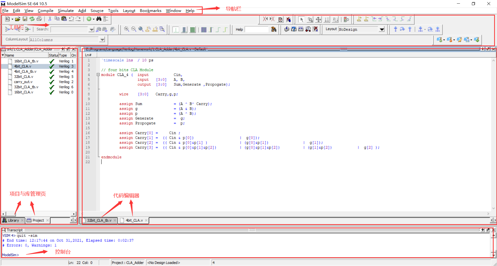
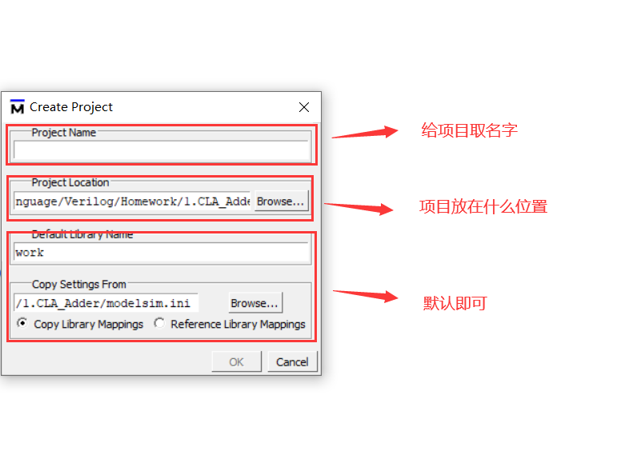
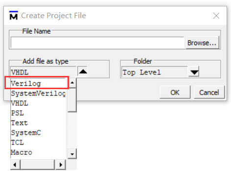
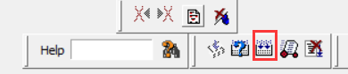
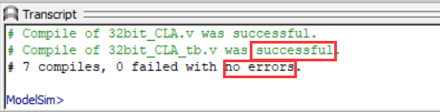
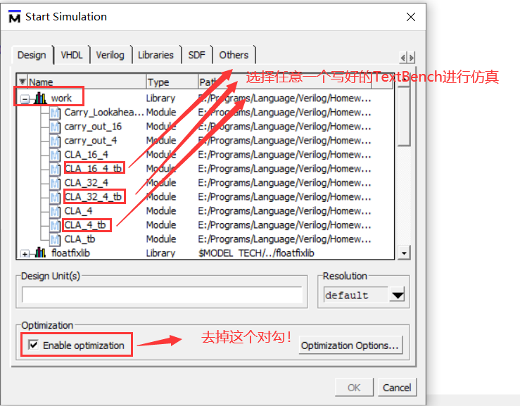
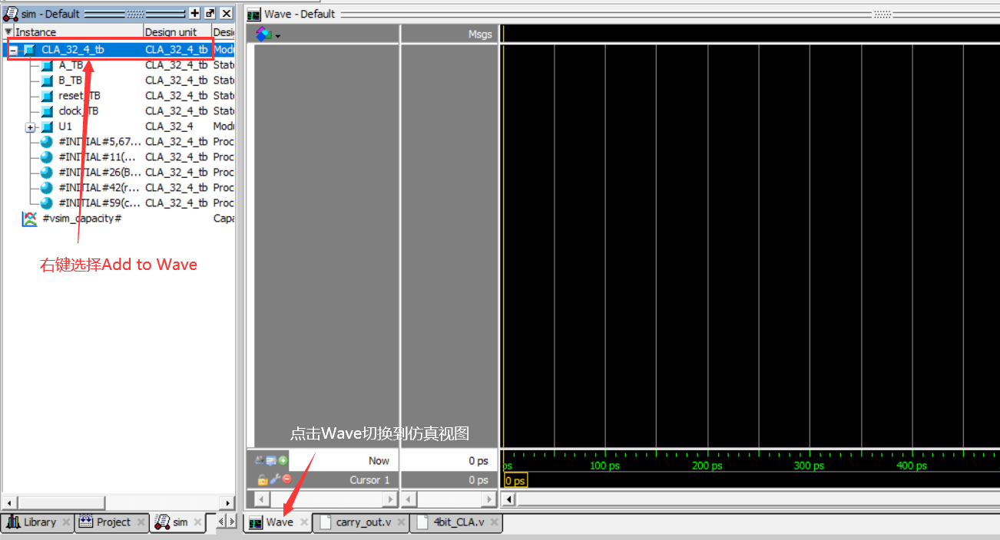
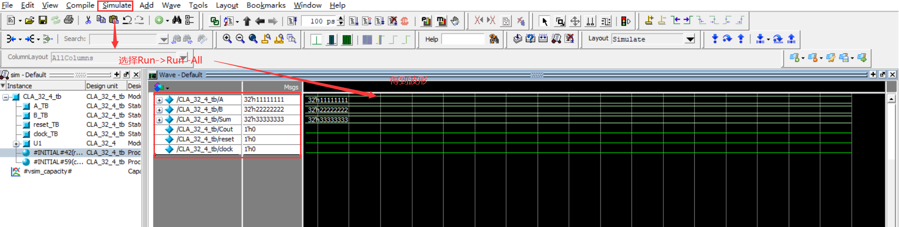
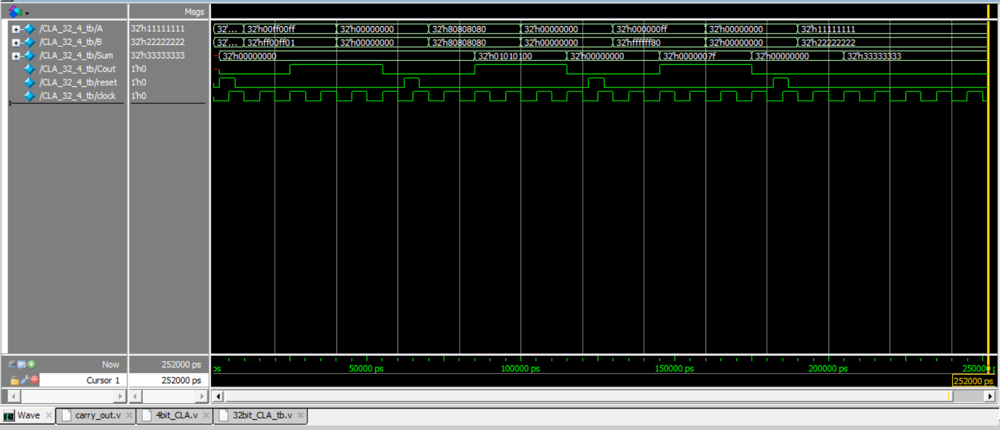
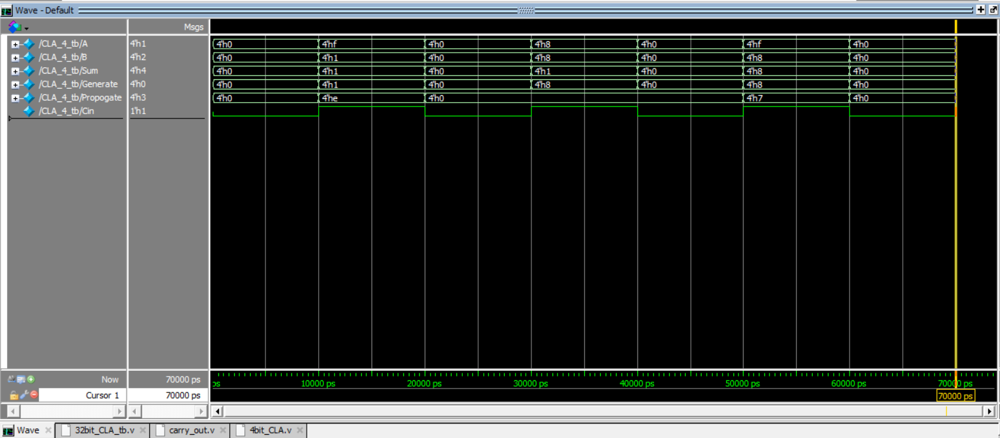

# Homework1

## ModelSim仿真工具

### 下载与安装

- 软件下载连接：

> 链接：https://pan.baidu.com/s/1YhuIr1IzG9YgHsRyBM0O_g 
> 提取码：jack 

- 软件安装与破解教程

  参考：https://zhuanlan.zhihu.com/p/142003657

### 界面

如下是ModelSim的基本页面

### 新建工程与文件

- 依次点击导航栏 File->New->Project新建工程：

- 在项目与管理页点击鼠标右键点击Add to project->New File：选择Verilog并给文件取名。

### 仿真

- 写好代码开始仿真，在工具栏中点击Comolie All按钮：

- 编译成功后控制台会显示：

- 编译成功后，选择导航栏Simulate->Start Simulation：选择work中的任意一个testbench文件开始仿真

- 随后添加波形：

- 根据上述操作得到：

- 点击仿真界面，按住”Ctrl+滚轮“调整显示尺度到合适的尺度，观察仿真结果即可。

## 作业仿真

### 4位CLA

### 32位CLA

