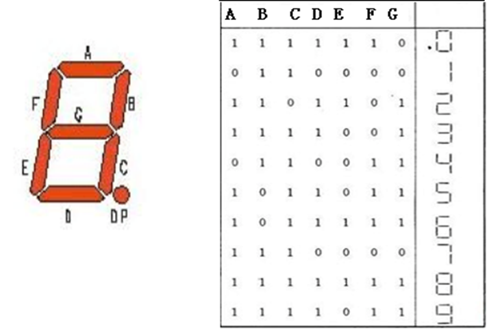
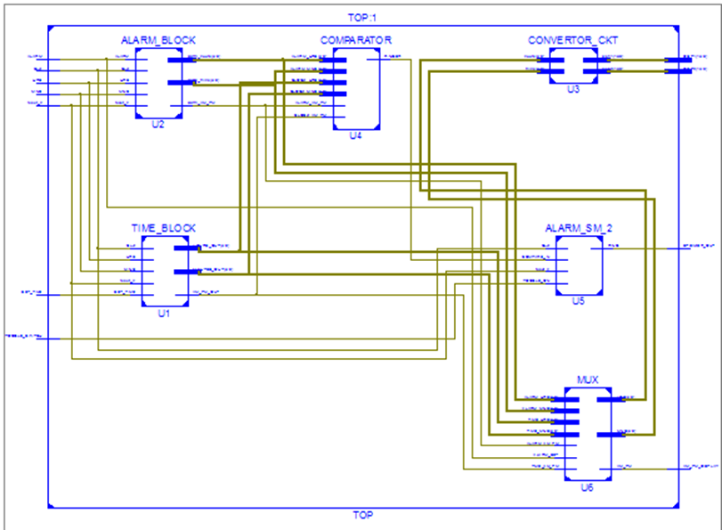
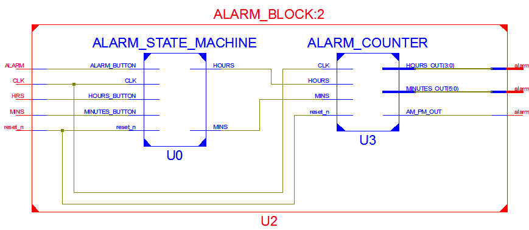
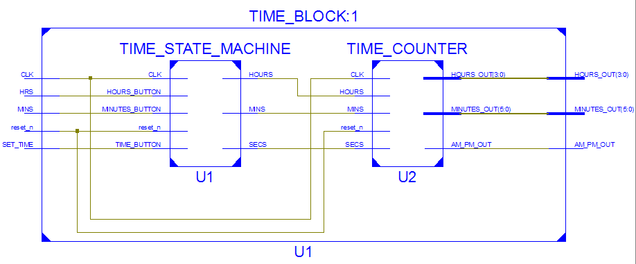
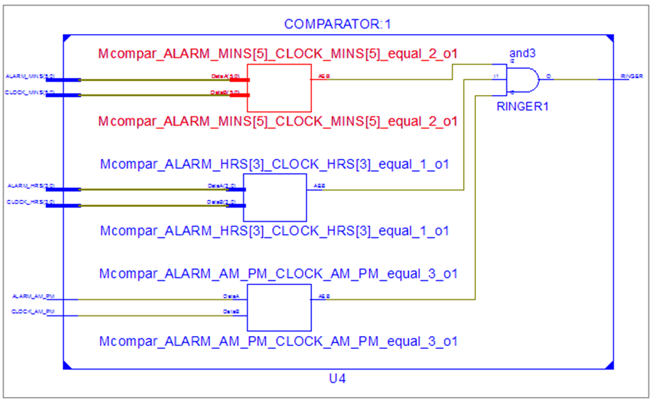
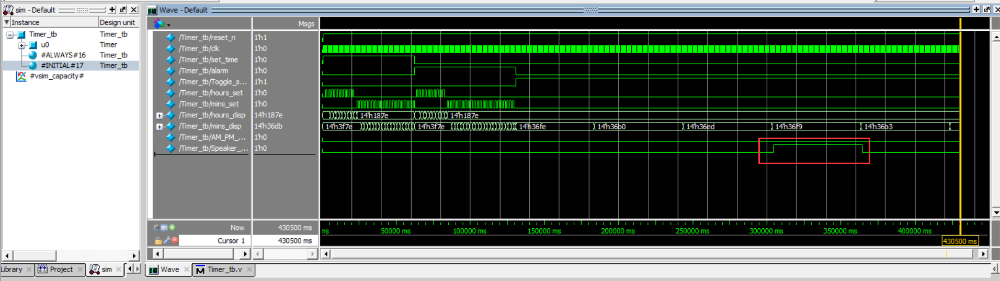

# Ext-Homework

## Introduction

设计一个简单的闹钟：

## Ports

| **序号** | **信号名称** | **方向** | **信号描述**          |
| -------- | ------------ | -------- | --------------------- |
| 1        | reset_n      | 输入     | 低电平有效复位信号    |
| 2        | clk          | 输入     | 时钟信号，时钟周期1秒 |
| 3        | Set_time     | 输入     | 时钟值设置信号        |
| 4        | alarm        | 输入     | 闹钟值设置信号        |
| 5        | Hours_set    | 输入     | 小时值设置信号        |
| 6        | Mins_set     | 输入     | 分钟值设置信号        |
| 7        | Toggle_sw    | 输入     | 闹铃开关信号          |
| 8        | Hours_disp   | 输出     | 小时显示驱动信号      |
| 9        | Mins_disp    | 输出     | 分钟显示驱动信号      |
| 10       | AM_PM_disp   | 输出     | AM/PM显示驱动信号     |
| 11       | speaker_out  | 输出     | 闹铃驱动信号          |

## Time Set

时钟值修改：

1. 打开set_time开关，即set_time信号为1时

2. 开关hours_set一次，即hours_set的值变为1后又变为0值，时钟小时值加1。

3. 开关一次mins_set开关，即mins_set的值变为1后又变为0值，分钟值加1。

4. 不支持hours_set和mins_set同时按下的情况

## Alarm Set

时钟值修改：

1. 打开alarm开关，即alarm信号为1时可修改闹钟。

2. 打开alarm，显示闹钟值 

3. 开关hours_set一次，即hours_set的值变为1后又变为0值，闹钟小时值加1。

4. 开关一次mins_set开关，即mins_set的值变为1后又变为0值，闹钟分钟值加1。

5. 不支持hours_set和mins_set同时按下的情况

## Toggle Switch

闹铃开关： TOGGLE_SWITCH

1. 打开TOGGLE_SWITCH开关，即TOGGLE_SWITCH为1，

2. 如果时钟达到设定的闹钟值，则将SPEAKER_OUT置为1，响铃。

3. 关闭TOGGLE_SWITCH开关，则将SPEAKER_OUT置为0，关闭闹铃。

## Clock Display

1. hours_disp、mins_disp分别是小时、分钟值显示驱动信号。

2. 数字显示由七段数码管显示，如图2所示。A、B、C、D、E、F、G信号分别控制一个发光二极管的开关，可以显示0-9数字，其控制如表2所示。

1. hours_disp[13：7]分别输出小时显示高位A、B、C、D、E、F、G的值，hours_disp[6：0]输出小时低位A、B、C、D、E、F、G的值。

2. mins_disp[13：7]分别输出小时显示高位A、B、C、D、E、F、G的值，mins_disp[6：0]输出小时低位A、B、C、D、E、F、G的值。

如显示小值12，则：

​	hours_disp[13：7] = 7'b011_0000；

​	hours_disp[ 6：0] = 7'b110_1101；

## Circuit

### Alarm Circuit

### Time Circuit

### Comparator Circuit

## Simulator

