# Practice

一些测试与练习的代码实现

## Practice1

根据图中电路，完成Verilog实现。

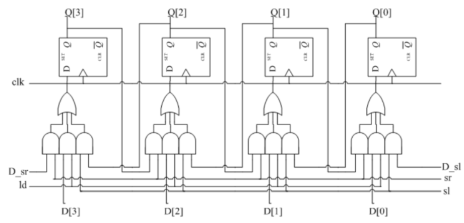

## Practice2

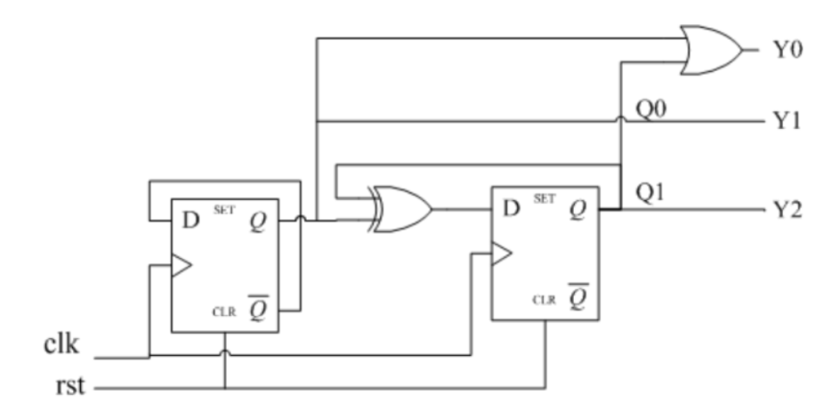

## Practice3

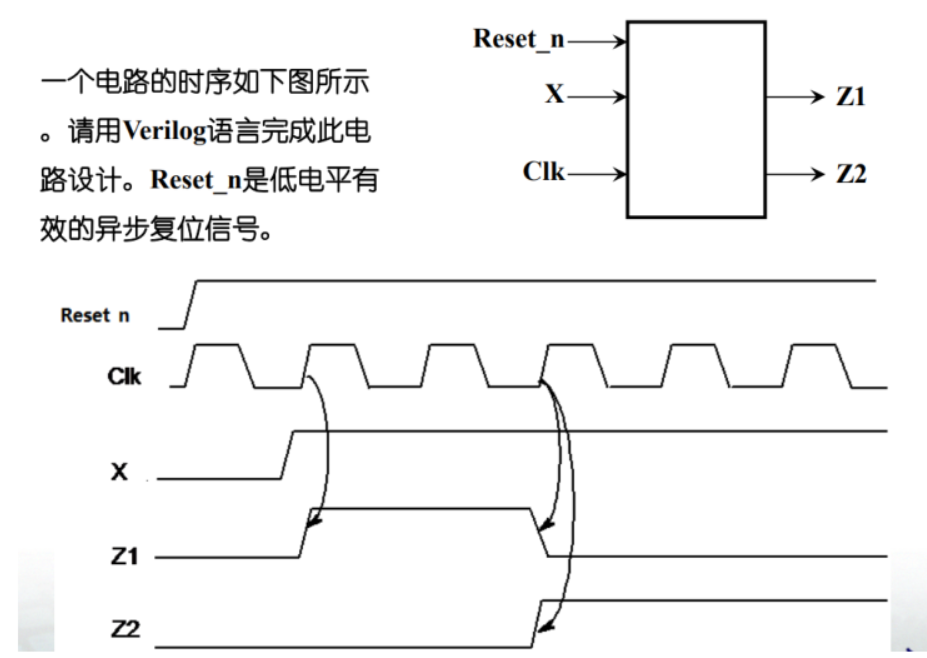

## Practice4

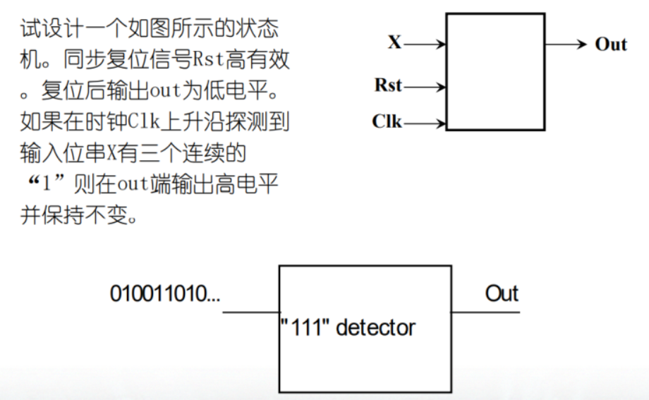

## Practice5

D 型主从触发器电路如下图所示，请用 verilog 语言对其进行门级描述。

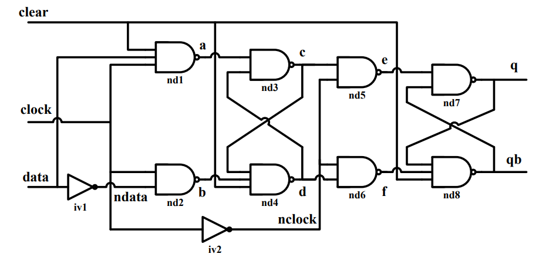

## Practice6

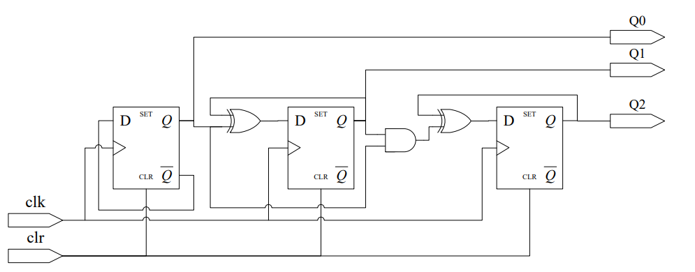

## Practice7

一个 32×8 的异步 SRAM 的外部端口如图所示，其读写信号时序图如图（时间 单位 ns)所示。

1. 试建立此 SRAM 的 Verilog 行为模型。
2. 给出此 SRAM 模型的测试程序，要求测试程序使用 task：
   1. 向地址 12 写入 8’H55，地址 13 写 8’HAA。 
   2. 再读取地址 12 和 13 的数据。

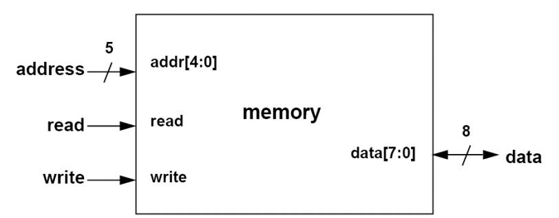

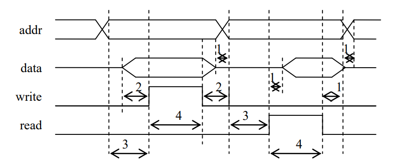

# Solution Conclusion

## State Machine

### 解题步骤

- 根据题目确定存在的**状态有多少种**，根据可能的种类来判断需要一个**多少位的参数变量来存储状态（parameter）**，例如：6中状态需要3位来存储。其中，参数一般用从0开始的二进制数递增方式表示。
- 定义一个**寄存器类型（reg）的状态变量**来表示当前所处的状态（state），其位数和状态参数一致。
- 确定时钟与复位信号同步与异步的选择，并且复位信号有效时需要将状态机置于初始状态，一般是（state0 = 0）的状态。
- 在复位信号无效的情况下，需要根据**所有状态作为case语句的各个分支**，并且在**各个分支下在根据不同的动作产生二级分支，一般动作（action）都是由输入的数据信号所决定**，一位的输入一般只有两种动作，只需要if……else……语句写即可，多于一位的输入信号会产生很多种动作导致状态的变化，一般用case语句来产生二级分支更好，并且在每个动作下除了状态的变化，还有一些参数需要变动的也在这些分支下取撰写。**注意每个动作最后需要加上default选项：用于判断x，z等情况。**
- 最后，**输出一般设置成wire类型，在过程快外用assign语句来赋值**，赋值的右式一般是state所处的状态，或者一些中间变量的组合。
- 注：还有将数据和控制分离的写法，**可以将state分支判断放在另一个always(\*)里面单独判断**，这种针对一位以上的输入，两位的状态机参考：[作业3](../8.Homework_Upgrade_Solution/3.Seq/Seq.v)。

### 实例分析

例如：练习4的状态机题解思路如下

```verilog
`timescale 1ns/1ns
module Detect111 (
    input   wire    X,
                    clk,
                    rst,
    output  wire    out
);
    // 定义一个寄存器类型（reg）的状态变量来表示当前所处的状态（state），其位数和状态参数一致，4种状态两位存储即可
    reg [1 : 0] state;

    // 根据题目确定存在的状态有多少种，根据可能的种类来判断需要一个多少位的参数变量来存储状态（parameter）
    parameter IDLE      = 2'b00;
    parameter State1    = 2'b01;
    parameter State2    = 2'b10;
    parameter State3    = 2'b11;

	// 确定时钟与复位信号同步与异步的选择，这里选择异步方式，注意rst高电平有效，需要posedge rst
    always @(posedge clk, posedge rst) begin
        // 复位信号有效时需要将状态机置于初始状态
        if(rst)
            state <= 0;
        else
            // 在复位信号无效的情况下，需要根据所有状态作为case语句的各个分支，这里即四个状态的IDLE，State1-3
            case (state)
                IDLE:
                    // 各个分支下在根据不同的动作产生二级分支，一般动作（action）都是由输入的数据信号所决定，一位的输入一般只有两种动作，只需要if……else……语句写即可
                    if(X)
                        state = State1;
                    else	// 包括X = 0，x，z
                        state = IDLE;
                State1:
                    if(X)
                        state = State2;
                    else
                        state = IDLE;
                State2:
                    if(X)
                        state = State3;
                    else
                        state = IDLE;
                State3:
                    state = State3;
            endcase
        
    end

    // 输出一般设置成wire类型，在过程快外用assign语句来赋值，赋值的右式一般是state所处的状态，或者一些中间变量的组合
    assign out = (state == State3);

endmodule
```

## DFF and Combinational Circuit

### 解题步骤

- 根据电路图判断输入输出端口，一般的D触发器（DFF，D flip-flop）的输出作为输出端口，如练习1，但是如果输出还需要做逻辑操作，那么一般最后会用一些组合后的变量作为最终的输出，那么D触发器的输出Q需要用中间变量存储，且是Reg类型。
- 输入端口一般包括时钟和复位信号，可采用同步或异步的方式设置复位信号，如果有其他输入信号一并加上，**输入信号都需要是net类型（如wire）**，**输出信号即D触发器Q端口或者Q端口继续组合产生的信号，输出信号一般设置为wire类型，也可以是reg类型，取决于最终再过程块中给输出赋值，还是assign给输出赋值**。中间需要定义的变量一**般只有D触发器的Q端口**，如果Q端口是输出端口则不需要再单独定义，且**中间变量都为reg类型**。
- 复位信号有效时，一般需要将定义的中间变量置零，复位信号无效时，电路正常工作，这时候需要在**过程块中写出所有Q端口的组合逻辑**，即**每个Q端口的输入是什么**。
- 最后**输出端口采用assign语句赋值（如果输出设置了wire类型）**，如果设置的reg类型，那么最终的输出也需要在过程块中赋值，且两种方式**等式右边是中间变量Q端口的组合**。

### 实例分析

例如：练习2的题解

```verilog
`timescale 1ns/1ns
module Counter (
    input   wire        clk,
                        rst,
    output  wire[2 : 0] Y 
);
    // 中间需要定义的变量一般只有D触发器的Q端口，且中间变量都为reg类型
    reg             Q1,
                    Q0;

    // 可采用同步或异步的方式设置复位信号,这里采用异步方式
    always @(posedge clk, posedge rst) begin
        // 位信号有效时，一般需要将定义的中间变量置零
        if(rst) begin
            Q0 <= 0;
            Q1 <= 0;
        end
        // 复位信号无效时，需要在过程块中写出所有Q端口的组合逻辑，即每个Q端口的输入是什么
        else begin
            Q0 <= ~Q0;
            Q1 <= Q0 ^ Q1;
        end   
    end

    // 输出端口采用assign语句赋值，等式右边是中间变量Q端口的组合
    assign Y[0]= Q0 | Q1;
    assign Y[1]= Q0;
    assign Y[2]= Q1; 
endmodule
```

## SRAM

双向SRAM通用代码段：

```Verilog
assign data_o   = rd_en? mem[addr] : 8'bz;

always @(posedge wr_en) begin
    mem[addr]   = data_in;
end  
```

如果是FIFO，`addr`需要改为相应的指针：

```verilog
assign data_o   = rd_en? mem[tail] : 8'bz;

always @(posedge wr_en) begin
    mem[head]   = data_in;
end 
```

双向驱动建模：

- 注意：inout类型端口只能只能声明wire类型，只能用assign赋值

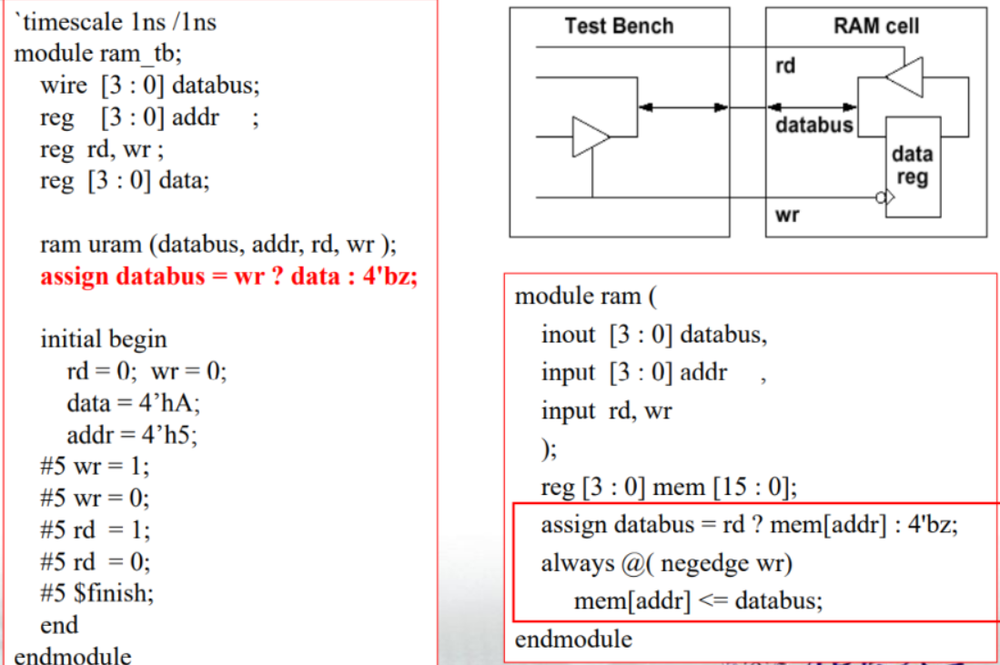

## 除法器设计


# Tips

## SHM波形数据库

波形显示工具从数据库，如SHM数据库中读取数据。使用下面的系统任务可以对SHM数据库进行操作：

| 系统任务                  | 描述                                         |
| ------------------------- | -------------------------------------------- |
| \$shm_open(“waves.shm”);  | 打开一个仿真数据库。同时只能打开一个库写入。 |
| \$shm_probe();            | 选择信号，当它们的值变化时写入仿真库         |
| \$shm_close;  \$shm_save; | 关闭仿真库  将仿真数据库写到磁盘             |

```verilog
initial
begin
    $shm_open(“./data/lab.shm”);
    $shm_probe( );
end
```

#### 用$shm_probe设置信号探针

- \$shm_probe的语法：

  \$shm_probe(scope0, node0, scope1, node1, ...);

  - 每个node都是基于前面scope的说明(层次化的）
  - scope参数缺省值为当前范围(scope)。node参数缺省值为指定范围的所有输入、输出及输入输出。

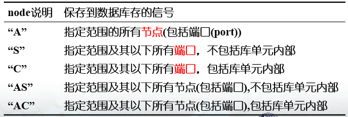

### 模块实例化

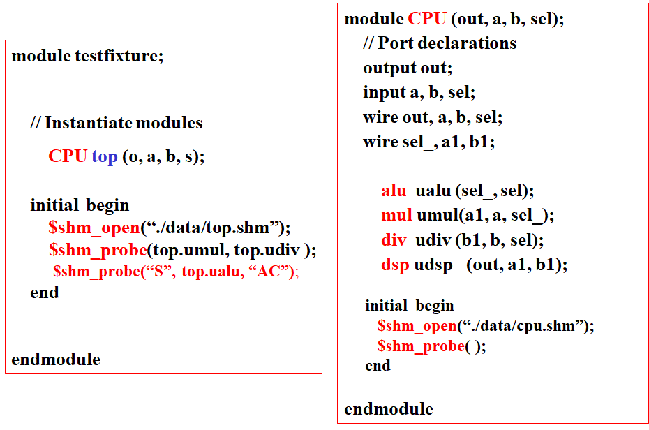

在\$shm_probe中使用scope/node对作为参数。参数可以使用缺省值或两个参数都设置。例如：

- \$shm_probe( ); 观测当前范围(scope)所有端口

- $shm_probe(“A”); 观测当前范围所有节点

- \$shm_probe(alu, adder); 观测实例alu和adder的所有端口

- \$shm_probe(“S”, top.alu, “AC”); 观测：

  (1): 当前范围及其以下所有端口，除库单元

  (2):top.alu模块及其以下所有节点，包括库单元

## VCD数据库

Verilog提供一系列系统任务用于记录信号值变化保存到标准的VCD(Value Change Dump)格式数据库中。大多数波形显示工具支持VCD格式。

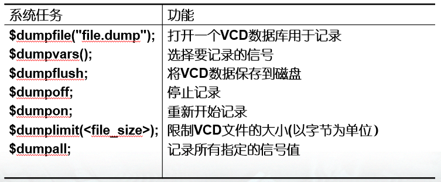

VCD数据库是仿真过程中数据信号变化的记录。它只记录用户指定的信号。

- 用户可以用\$dump系统任务打开一个数据库，保存信号并控制信号的保存。除\$dumpvars外，其它任务的作用都比较直观。 \$dumpvars将在后面详细描述。
- 必须首先使用\$dumpfile系统任务，并且在一次仿真中只能打开一个VCD数据库。
- 在仿真前(时间0前)必须先指定要观测的信号，这样才能看到信号完整的变化过程。
- 仿真时定期的将数据保存到磁盘是一个好的习惯，万一系统出现问题数据也不会全部丢失。
- VCD数据库不记录仿真结束时的数据。因此如果希望看到最后一次数据变化后的波形，必须在结束仿真前使用*\$dumpall*。

要给\$dumpvars提供层次(levels)及范围(scope)参数，例如

```verilog
$dumpvars;   // Dump所有层次的信号
$dumpvars (1, top); // Dump top模块中的所有信号
$dumpvars (2, top.u1); // Dump实例top. u1及其下一层的信号
$dumpvars (0, top.u2, top.u1.u13.q); // Dump top.u2及其以下所有信号，以及信号top.u1.u13.q。
$dumpvars (3, top.u2, top.u1); // Dump top.u1和top.u2及其下两层中的所有信号。
```

用下面的代码可以代替前面test fixture的*\$monitor*命令:

```verilog
initial
        begin
            $dumpfile (“verilog.dump”);
            $dumpvars (0, testfixture);
    	end
```

### $dumpvars语法

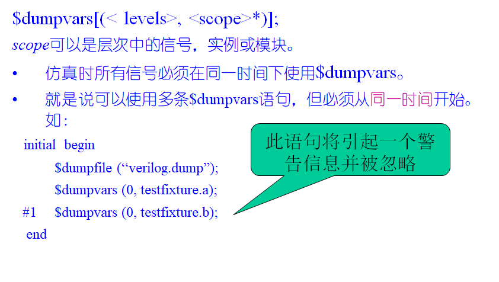

## File Output

```verilog
. . .
integer MCD1;
    MCD1 = $fopen("<name_of_file>");
    $fdisplay( MCD1, P1, P2, .., Pn);
    $fwrite( MCD1, P1, P2, .., Pn);
    $fstrobe( MCD1, P1, P2, .., Pn);
    $fmonitor( MCD1, P1, P2, .., Pn);
    $fclose( MCD1);
. . .
```

- $fopen打开一个文件并返回一个多通道描述符（MCD）。

  - MCD是与文件唯一对应的32位无符号整数。

  - 如果文件不能打开并进行写操作，MCD等于0。

  - 如果文件成功打开，MCD中的一位被置位。

- 以\$f开始的显示系统任务将输出写入与MCD相对应的文件中。 

- \$fopen打开参数中指定的文件并返回一个32位无符号 整数MCD，MCD是与文件一一对应的多通道描述符。如果文件不能打开并进行写操作，它返回0。
- $fclose关闭MCD指定的通道。
- 输出信息到log文件和标准输出的四个格式化显示任务(\$display, \$write, \$monitor, \$strobe）都有相对应的任务用于向指定文件输出。
- 这些对应的任务（\$fdisplay,\$fwrite,\$fmonitor,\$fstrobe）的参数形式与对应的任务相同，只有一个例外：第一个参数必须是一个指定向何哪个文件输出的MCD。MCD可以是一个表达式，但其值必须是一个32位的无符号整数。这个值决定了该任务向哪个打开的文件写入。
- MCD可以看作由32个标志构成的组，每个标志代表一个单一的输出通道。

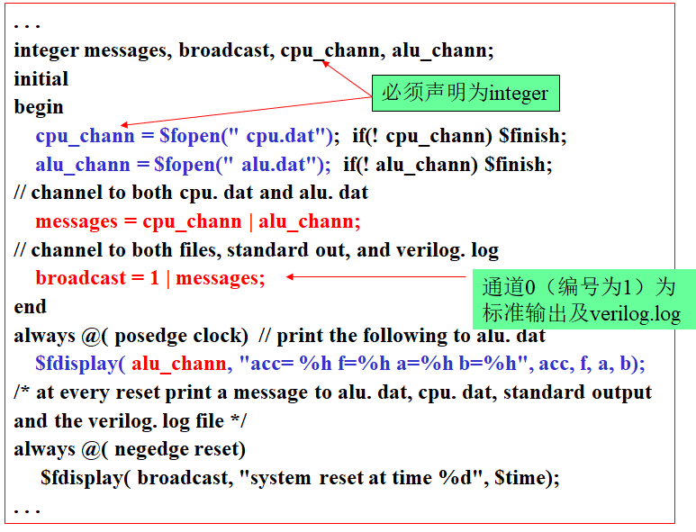

## File Input

- Verilog中有两个系统任务可以将数据文件读入寄存器组。一个读取二进制数据，另一个读取十六进制数据：

- \$readmemb

  \$readmemb ("file_name", <memory_name>);

  \$readmemb ("file_name", <memory_name>, <start_addr>);

  \$readmemb ("file_name", <memory_name>, <start_addr>, <finish_addr>);

- $readmemh

  \$readmemh (" file_name", <memory_name>);

  \$readmemh (" file_name", <memory_name>, <start_addr>);

  \$readmemh (" file_name", <memory_name>, <start_addr>, <finish_addr>);

系统任务\$readmemb和\$readmemh从一个文本文件读取数据并写入存储器。

- 如果数据为二进制，使用\$readmemb；如果数据为十六进制，使用\$readmemh。
- filename指定要读入的文件。
- mem_name指定存储器信号名称。
- start和finish给出存储器加载的地址。Start为开始地址，finish为结束地址。如果不指定开始和结束地址，\$readmem按从低端开始读入数据，与说明顺序无关。

```
$readmemb和$readmemh的文件格式 ：
            $readmemb("mem_file. txt", mema);
```

- 可以指定二进制（b）或十六进制（h）数
- 用下划线“_”提高可读性。
- 可以包含单行或多行注释。
- 可以用空格和换行区分各个数据。
- **可以给后面的值设定一个特定的地址**，格式为：
  -    @(hex_address)
       - 十六进制地址的大小写不敏感。
       - **在@和数字之间不允许有空格。** 

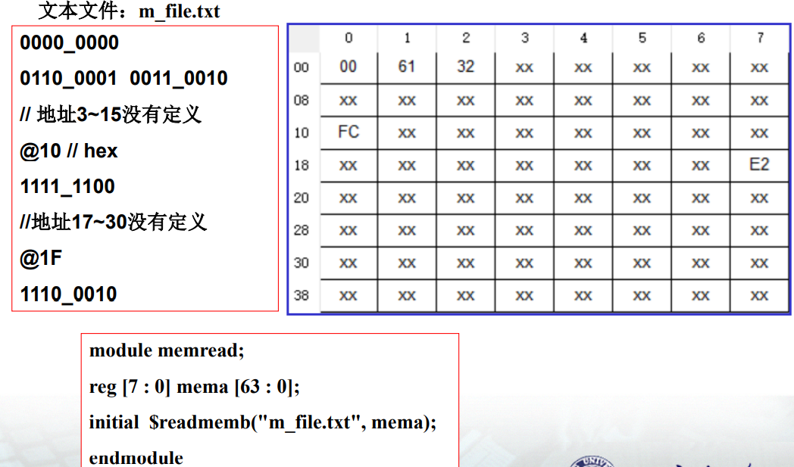

## 设计代码流程与总结：

1. 撰写design代码（正常写法与状态机写法，注意变量类型）
2. 撰写testbench（注意变量类型，测试全面，校验代码），考虑时钟，激励方式等
3. 考虑将一些冗余代码修改为Task，函数等高级形式撰写
4. 参数化变量，task或function
5. 合理增加注释，注解，检查变量命名合理性
6. 增加关键变量的信息打印（monitor，display，write等），并考虑将其写入日志文件
7. 使用shm或vcd库记录波形数据，或者通过文件输入输出写到磁盘文件里
8. specify时序设置，时序检查setup，hold等

**注意**：

👆上述要点用法测试程序见：👉[Mod_tb程序](../8.Homework_Upgrade_Solution/6.Mod/Mod_tb.v)(测试了VCD，File Output，File Input)和[mod_fsm程序](../8.Homework_Upgrade_Solution/6.Mod/data_mod_fsm.v)👈（测试Specify），其中SHM软件不支持。


