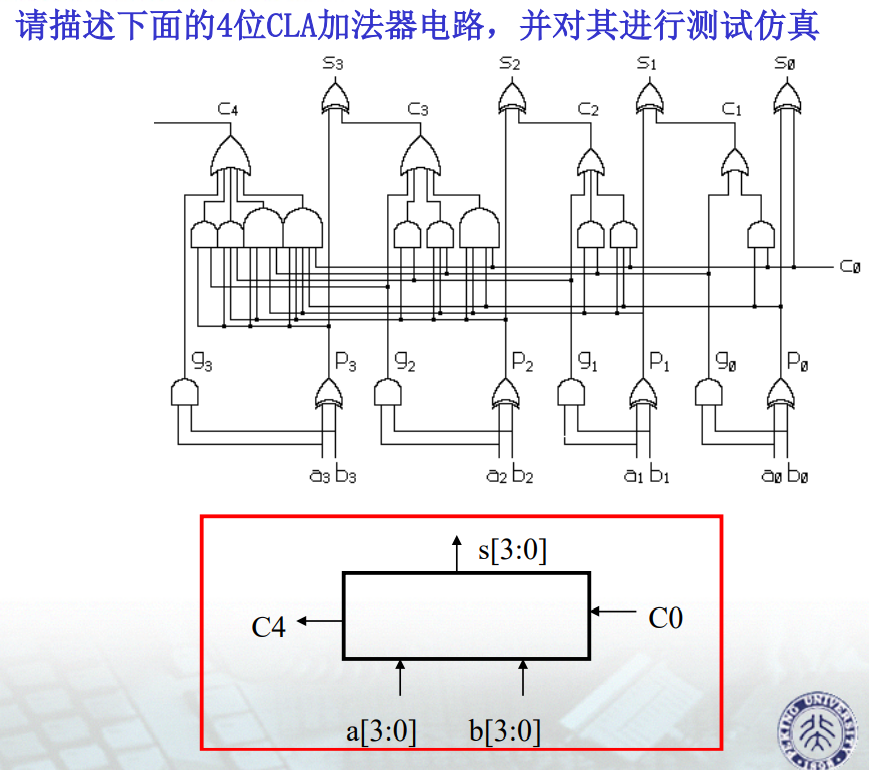
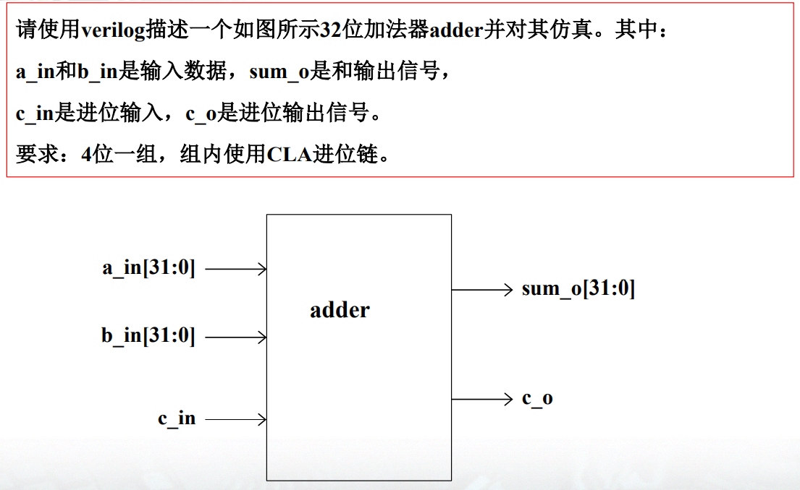
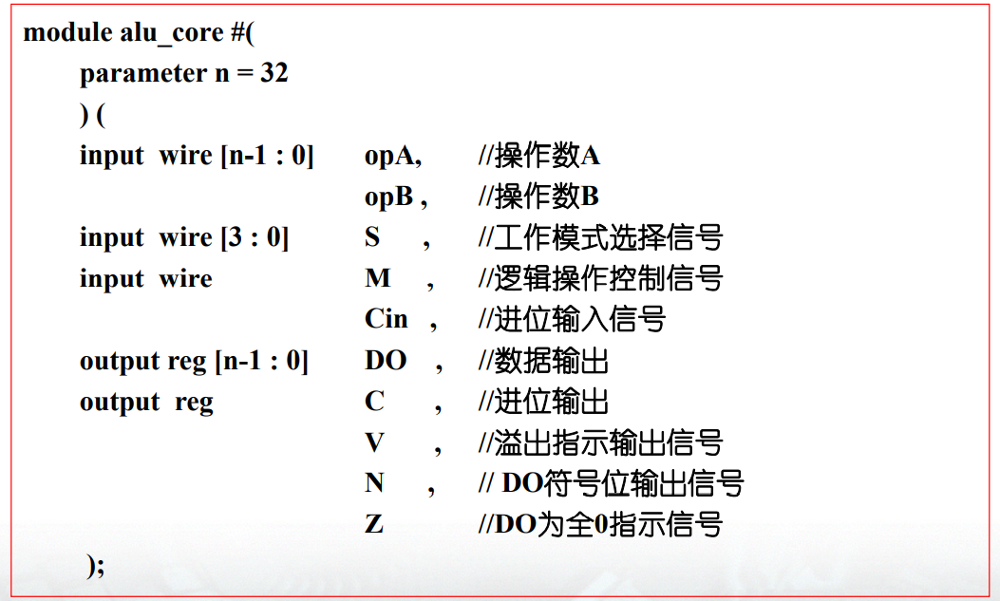
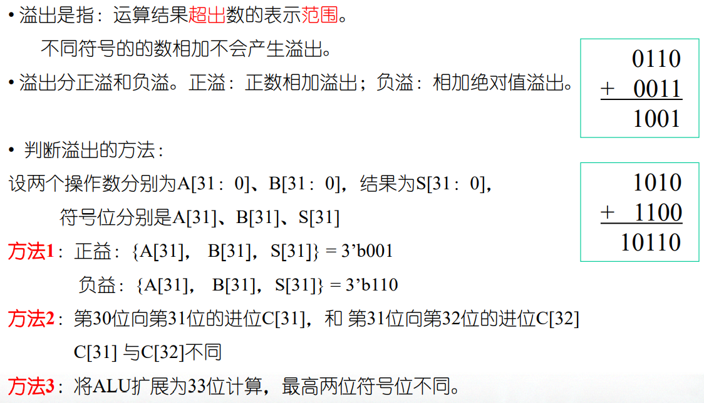
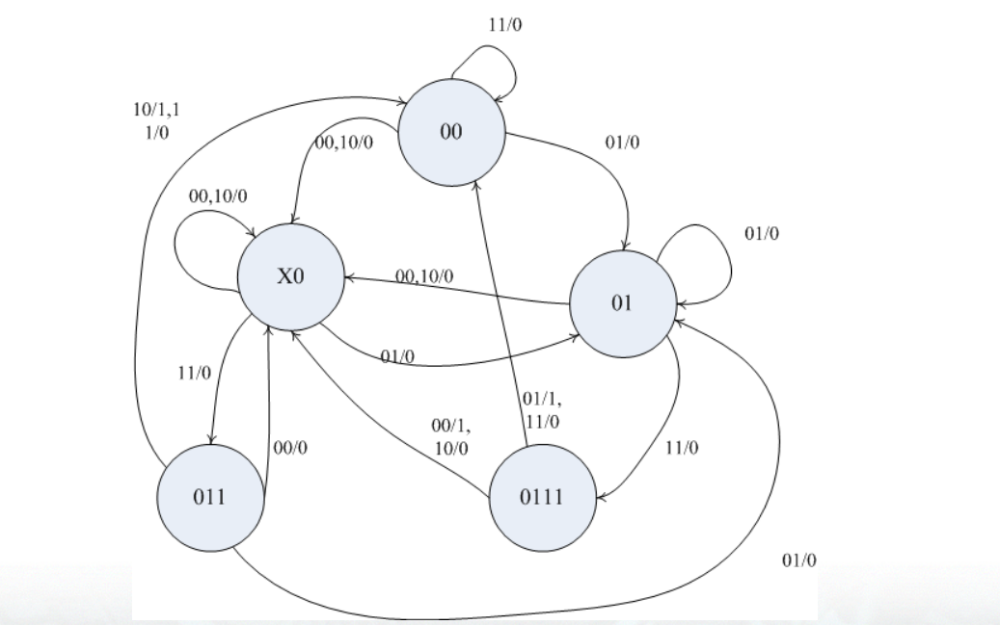
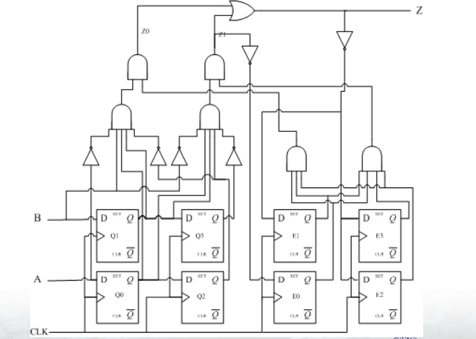
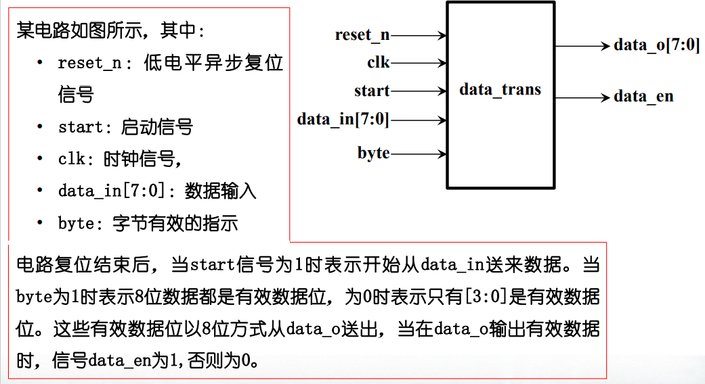
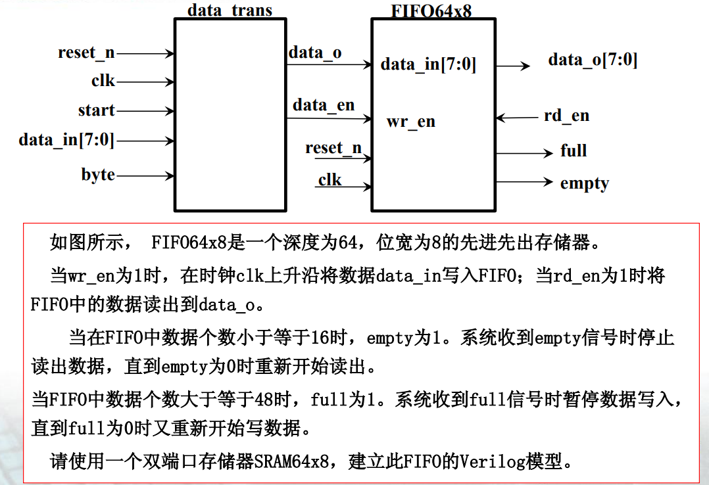
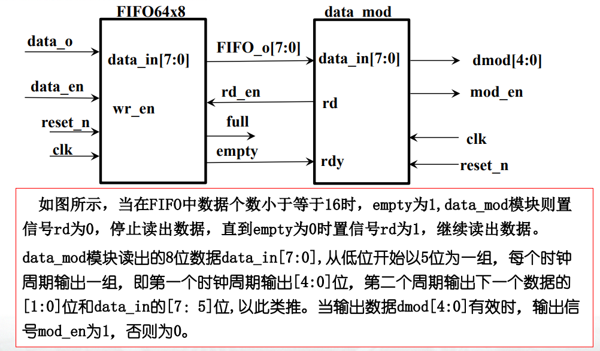
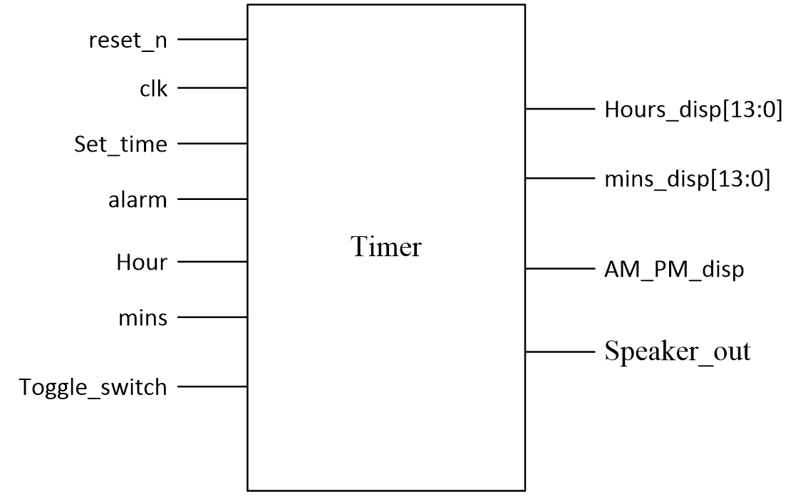

# Digital IC Design

Assignment of digital integrated circuit design course of Peking University - FPGA design

北京大学数字集成电路设计课程作业—FPGA设计

## Homework1

4位超前进位加法器的设计与32位超前进位加法器的设计。

## Homework2

ALU设计：完成一个32位ALU设计并进行功能验证。

ALU计算溢出的判断方法

## Homework3

## Homework4

## Homework5

## Homework6

## Ext-Homework

设计一个简单的闹钟：详细设计见：[Timer](./7.Ext_Homework_Timer)

## Better Solution

参考Part8：[`8.Homework_Upgrade_Solution`](./8.Homework_Upgrade_Solution)目录下的解决办法。

## Practice

一些练习与解题思路的八股总结：👉[见这里](./9.Practice)

- 状态机的基本解题步骤
- D触发器和组合逻辑电路转化为Verilog代码
- 双向RAM
- 一些Tips

## Key Word

集成电路设计名词：

- **Synthesis**：综合，包括translation + optimization + mapping

- **工艺无关性**：设计可以应用到任何工艺

- **HDL Compiler**：HDL Compiler将HDL描述转换为Synopsys 设计块，并传送给Design Compiler

- **Design Compiler**：Design Compiler将 Synopsys设计块映射到用户指定库的门级设计

- **Design(设计)**：完成一个或多个逻辑功能的电路 

- **Cell (单元)** ：一个设计在另一个设计中的实例 

- **Reference (引用)** ：单元(Cell)指向的原始设计，如verilog module 

- **Port (端口)** ：设计的输入或输出接口 

- **Pin (引脚)** ：单元(Cell)的输入或输出接口 

- **Net (网线)** ：Port-Pin或Pin-Pin之间的连接线 

- **Clock (时钟)** ：指定为时钟源的Port或Pin

- **时序弧**：一段连接线(net)延时或一个单元(cell)延时

- **环境约束**：对电路工作的外在环境，包括电路的工作电压、工作温度以及工艺变化，以及电路与周边其它电路的关系，包括输入引脚的延时及驱动能力，输出引脚的负载及输出延时。

- **Load Budget：负载预算**，即输出端口驱动能力最小单元驱动（反相器），限制每个输入端口的输入电容，估算输出端口驱动模块的数目。

- **Wire Load Model**：wire load model根据芯片面积和标准单元的扇出估算连接线上的电容，分为top，enclosed，segmented三种类型。

- **Constraint：约束**，Design Compiler优化一个设计到目标工艺库的目标

- **设计规则约束**：与工艺相关的限制，如最大的传输时间、最大的扇出、最大电容等。 

- **优化约束**：设计目标及要求。如最大延时、最小延时、最大面积、最大功耗等。

- **PAD**：IO pad是一个芯 管脚处理模块，即可以将芯片管脚的信号经过处理送给芯片内部，又可以讲芯片内部输出的信号经过处理送到芯片管脚

- **上升（下降）延时**：信号从 10%电平上升（下降）到 90%电平所需要的时间

- **False Path**：在电路中一种有物理连接的路径，是不传播信号的通路，或是忽略这个通路上的时序约束

- **多周期通路**：在有些情况下，两个寄存器之间的组合逻辑延迟可能要求多于一个时钟周期，这些通路应设置为Multi-Cycle通路，解决办法有dont_touch、ungroup、uniquify
  - 最简单的方法是uniquify, 但需要较多的存储器和编译时间
  - 如果希望保留设计层次并资源共享，使用dont_touch
  - 如果希望得到一个最好的结果，推荐使用 ungroup，但需要的存储器和编译时间最多。
  
- **逻辑级优化**：technology  independent optimization，对电路的布尔表达式进行优化，对整个设计面积/速度特性有全局的影响，包括flatten ( 缺省为关 ) : 清除所有中间变量，使用布尔分配定律去除所有括号；structure : 提取公用逻辑

- **门级优化**：从工艺库中选择元件以实现这些逻辑结构，以满足电路指定的时间、设计规则和面积目标，包括map，使设计与工艺相关

- **Slack**：要求时间与实际到达时间的差值结果。

- **资源共享**：指多节代码共享一组逻辑。

- **CTLF**：（Compiled Timing Library Format）编译的时序库格式。特定工艺元件数据的标准格式。

- **GCF**：（General constraint Format)通用约束格式。约束数据的标准格式。

- **MIPD**：（Module Input Port Delay)模块输入端口延时。模块输入或输入输出端口的固有互连延时

- **MITD**：(Multi-source Interconnect Transport Delay)多重互连传输延时。与SITD相似，但支持多个来源的不同延时。

- **PLI**：（Programming Language Interface）编程语言界面。基于C的对Verilog数据结构的程序访问。

- **SDF**：Standard Delay Format.(标准延迟格式)。时序数据OVI标准格式。

- **SITD**：Single-Source Interconnect Transprot Delay，单一源互连传输延迟。和MIPD相似，但支持带脉冲控制的传输延迟。

- **SPF**：Standard Parasitic Format.（标准寄生参数格式）。提取的寄生参数数据的标准格式。

- **IOPATH延时**：器件从输入端口到输出端口的一个合法路径上的延时

- **惯性延迟**：若路径延时小于门的固有延时，信号会被淹没。

- **传输延迟**：输入上每个变化都会反映到输出上。

- **模块路径(module path)**：穿过模块，连接模块输入(input端口或inout端口）到模块输出(output端口或inout端口）的路径。

- **路径延时(path delay)**：与特定路径相关的延时

- **时序检查(timing check)**：监视两个输入信号的时间关系并进行检查的系统任务，以保证电路能正确工作。

- **时序驱动设计(timing driven design)**：从前端到后端的整个设计流程中，用时序信息连接不同的设计阶段。

- **块延时**：将全部延时集中到最后一个门上。这种模型简单但不够精确，只适用于简单电路。因为当到输出端有多个路径时不能描述不同路径的不同延时。

- **分布延时**：将延时分散到每一个门。在相同的输出端上，不同的路径有不同的延时。

- **路径延时**：在专用的specify块描述模块从输入端到输出端的路径延时。

- **SDPD，状态依赖路径延时**：在说明的条件成立时赋予路径一个延时。

- **NonRecurring-Engineering ( NRE )**：集成电路产品的研制开发费，设计人工费，计算机软硬件 设备折旧费以及试制过程中所需的制版、工艺加工、测试分析等研发过程中的一次性开支。 

- **Wafer Size**： 晶圆大小，4英寸， 6英寸，8英寸，12英寸 

- **Feature size**：特征尺寸 

- **Die size**：芯片棵柆尺寸 

- **Moore’s Law**：加工能力每18个月翻一番 

- **等效门**：一个等效门是一个二输入NAND门 

- **RTL**：寄存器传输级 

- **HDL**：硬件描述语言 

- **Defect density**：缺陷密度，影响成品率 

- **yield**：成品率（良率）

- **FPGA**：现场可编程阵列

- **系统级设计**：确定算法，完成行为级模型并对系统功能进行验证，完成系统软硬件划分，确定系统功能框图。由系统工程师完成。要求系统工程师熟悉硬件设计、软件设计、PCB设计等。主要工具：SPW、matlab等。 

- **前端设计**：根据系统框图和算法，完成RTL设计及其验证。将RTL设计进行综合，并完成综合后验证，得到门级网表。由前端工程师完成。主要工具：schematic editor、Verilog/VHDL simulator、Synopsys Design Compiler、Power Compiler、Prime Time、DFT、Formality等。 

- **后端设计**：根据网表及综合约束，完成版图设计及验证。由后端工程师完成，主要工具：ultra/SoC Encounter、 Prime Time /layout editor、DRC、ERC、LVS的Calibra。

- **MPW(Multi-Project Wafer）**：将多种具有相同工艺的集成电路设计放在同一个硅圆片。

- **仿真器**：读入HDL并进行解释及执行的一种软件 

- **抽象级**：描述方式的详细程度，如行为级和门级 

- **ASIC**：专用集成电路(Application Specific Integrated Circuit) 

- **ASIC Vender**：芯片制造商，开发并提供单元库 

- **Bottom-up design flow** ：一种先构建底层单元，然后由底层单元构造更大的系统的设计方法 

- **Top-down design flow** ：一种设计方法，先用高抽象级构造系统，然后再设计下层单元

- **Tcl**：Tool command Language, 向交互程序输入命令的描述语言

- **行为级**：用功能块之间的数据流对系统进行描述；在需要时在函数块之间进行调度赋值

- **RTL级/功能级**：用功能块内部或功能块之间的数据流和控制信号描述系统；基于一个已定义的时钟的周期来定义系统模型 

- **结构级/门级**：用基本单元(primitive)或低层元件(component)的连接来描述系统以得到更高的精确性，特别是时序方面；逻辑综合时用特定工艺和低层元件将RTL描述映射到门级网表

- **primitives(基本单元)** : Verilog语言已定义的具有简单逻辑功能的功能模型(models)

- **扇出（fan-out）**：是一个定义单个逻辑门能够驱动的数字信号输入最大量的专业术语

- **插入延迟**：时钟有效沿从芯片的输入引脚到达负载的时间。 

- **时钟倾斜**：同一个时钟有效沿到达各个负载的时间差。

  
