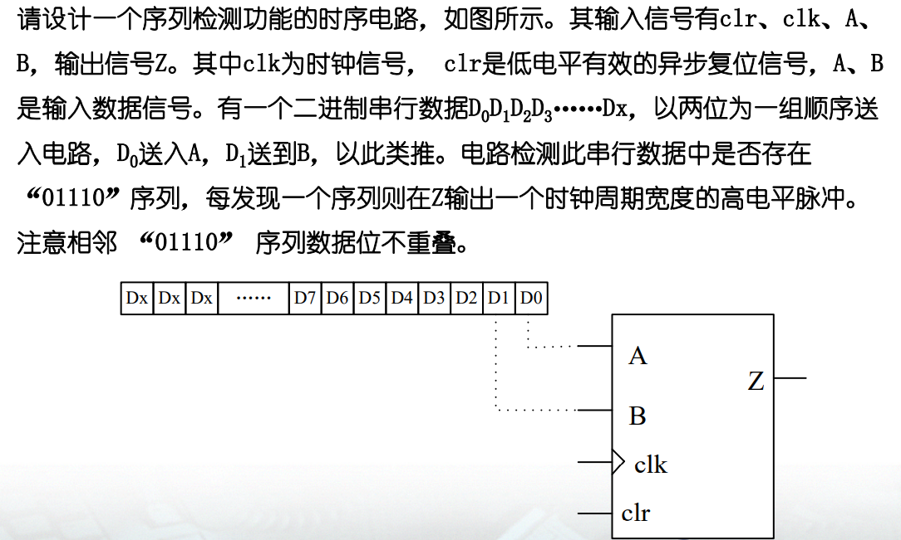

# Digital IC Design

Assignment of digital integrated circuit design course of Peking University - FPGA design

北京大学数字集成电路设计课程作业—FPGA设计

## Homework1

4位超前进位加法器的设计与32位超前进位加法器的设计。

## Homework2

ALU设计：完成一个32位ALU设计并进行功能验证。

ALU计算溢出的判断方法

## Homework3

## Homework4

